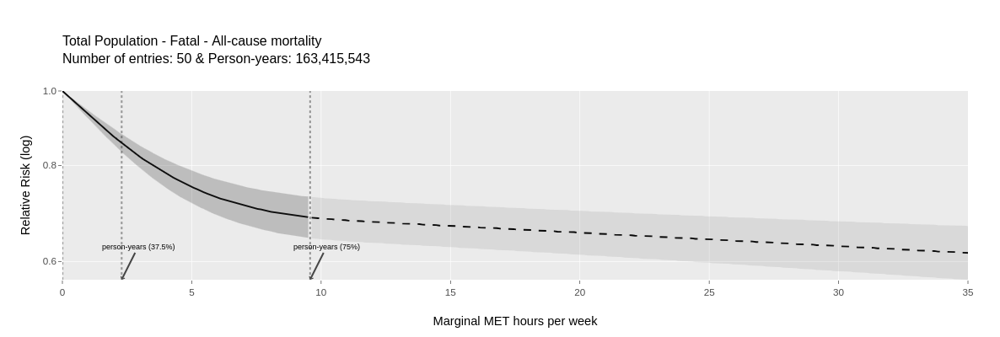

# Part A: Learning objectives:

This practical provides an in-depth examination of scenario generation, with a focus on developing a comprehensive understanding of travel behaviour.

```{r setup}
#| echo: false
#| warning: false
#| eval: true
#| message: false
library(tidyverse)
library(here)
library(gt)
library(plotly)
# Read io
io <- readRDS(here("data/lecture_3/ithim_io/io.rds"))
# Read trips from the io object and remove ghost trips (with participant_id = 0)
trips <- io$bogota$trip_scen_sets |> filter(participant_id > 0)
# Set palette for gt table
global_palette <- "viridis" #c("#fee8c8", "#e34a33")


theme_set(theme_minimal(base_family = "Spline Sans"))
theme_update(
  panel.grid.minor = element_blank(),
  panel.grid.major = element_blank(),
  axis.line.x = element_line(color = "grey80", linewidth = .4),
  axis.ticks.x = element_line(color = "grey80", linewidth = .4),
  plot.margin = margin(10, 15, 10, 15)
)


scen_colours <- c("Baseline" = '#b15928',
                  "Cycling" = '#abdda4',
                  "Car" = '#d7191c',
                  "Bus" = '#2b83ba',
                  "Motorcycle" = '#fdae61')


mode_colours <- c("pedestrian" = '#99d8c9',
                  "cycle" = '#abdda4',
                  "car" = '#d7191c',
                  "bus" = '#2b83ba',
                  "motorcycle" = '#fdae61',
                  "other" = '#fee8c8')


```

## Baseline travel behaviour

### Trip distribution by mode

Prior to scenario creation, this section examines the distribution of trips across different modes within the baseline travel behaviour.

```{r}
#| warning: false
# Read in the trips dataset
trip_dist <- trips |>  
    # Keep unique trips id - ignoring stage level info
    distinct(trip_id, scenario, .keep_all = T) |> 
    # Remove ghost trips (vehicle trips)
    filter(participant_id > 0, 
           # Only look at the baseline travel diary
           scenario == "baseline") |> 
    # Count grouped data by trip mode
    count(trip_mode) |> 
    # Calculate frequency as proportion
    mutate(freq = n/sum(n)) |> 
    # Remove n
    dplyr::select(-n) |> 
    # Change to wide format
    pivot_wider(names_from = trip_mode, values_from = freq)

trip_dist |> 
    # Create a gt table
    gt() |> 
    # Format all numbers as percentage
    fmt_percent(
      columns =  where(is.numeric),
      decimals = 1
    ) |> 
  # Colour them according to their values
  data_color(columns = where(is.numeric), 
             # Pick range from min to max
             domain = c(trip_dist |> as.numeric() |> min(na.rm = T), 
                        trip_dist |> as.numeric() |> max(na.rm = T)), 
             # Set viridis palette
             palette = global_palette) |> 
  # Set table header and subtitle
  tab_header(
          title = "Percentage Distribution by Trip Mode",
          subtitle = "Values represent percentages summing to 100"
        )


```

The bus mode exhibits the highest share at `r round(trip_dist$bus * 100, 1)`(%), while the other category demonstrates the lowest share at `r round(trip_dist$other * 100, 1)`(%).

::::: {.callout-tip title="Quick Quiz" appearance="minimal"}
#### Question 1: Mode with Highest Share

Based on the percentage distribution table above, which travel mode has the **highest share** of trips?

```{ojs}
//| echo: false
viewof q1_mode_answer = Inputs.radio(
  ["bus", "car", "pedestrian", "cycle", "motorcycle", "other"],
  {
    value: null,
    label: html`<b></b>`,
    format: x => ({
      bus: "Bus",
      car: "Car",
      pedestrian: "Pedestrian",
      cycle: "Cycle",
      motorcycle: "Motorcycle",
      other: "Other"
    })[x]
  }
)
```

```{ojs}
//| echo: false
q1_mode_feedback = {
  if (q1_mode_answer == null) return html`<i>Please select one option.</i>`;
  return q1_mode_answer === "bus"
    ? html`<span style="color: green; font-weight: bold;">Correct! The bus mode has the highest share of trips.</span>`
    : html`<span style="color: red; font-weight: bold;">Incorrect. Try again.</span>`;
}
```

::: {style="margin-top: 1rem;"}
\${q1_mode_feedback}
:::

------------------------------------------------------------------------

#### Question 2: Combined Mode Share

What is the **combined percentage share** of `bus` and `pedestrian` modes together? Enter the value rounded to one decimal place (e.g., 50.0).

```{ojs}
//| echo: false
viewof q2_combined_input = Inputs.text({
  value: "",
  placeholder: "Enter percentage (e.g., 52.5)",
  label: html`<b></b>`
})
```

```{ojs}
//| echo: false
q2_combined_answer = 60.3;

q2_combined_feedback = {
  if (q2_combined_input.trim() === "") return html`<i>Please enter a value.</i>`;
  const userValue = parseFloat(q2_combined_input);
  if (isNaN(userValue)) return html`<span style="color: red;">Please enter a valid number.</span>`;
  const isCorrect = Math.abs(userValue - q2_combined_answer) <= 0.1;
  return isCorrect
    ? html`<span style="color: green; font-weight: bold;">Correct! Bus (${q2_combined_answer}%) has the highest individual share.</span>`
    : html`<span style="color: red; font-weight: bold;">Incorrect. Try again.</span>`;
}
```

::: {style="margin-top: 1rem;"}
\${q2_combined_feedback}
:::
:::::

#### Distribution using Cumulative Distribution Function (CDF)

We have defined three distance categories, which are:

1.  Short trips within `2 km` distance

2.  Medium trips between `2` and `6 km` distance

3.  Long trips with `6+ km` distance

These categories are derived from domain expertise and empirical distance distributions observed in travel diary datasets. It should be noted that these thresholds are not fixed and can be user-defined in the parameters sheet. The following analysis examines how distances for `bus`, `car`, `cycle` and `pedestrian` trips are distributed across these categories.

```{r}
 plotly::ggplotly(ggplot(trips |> 
                           filter(scenario == "baseline", 
                                  stage_mode %in% c('bus', 'car', 
                                                    'cycle', 'pedestrian')), 
                         aes(x = stage_distance, color = stage_mode)) +
     stat_ecdf(geom = "step") +
     geom_vline(alpha = 0.3, xintercept = 2, linetype = "solid", color = "black") +
     geom_vline(alpha = 0.3, xintercept = 6, linetype = "solid", color = "black") +
     scale_colour_manual(values = mode_colours, name = "Travel Mode") +
     coord_cartesian(ylim = c(0, 1)) +
     labs(x = "Distance (km)", y = "Cumulative Distribution Function (CDF)",
          title = "Distribution of distance (km) by mode \n\n") +
     theme_minimal()) |> 
  plotly::add_annotations(text="2 km",
                  x = 1.5, 
                  y = 1, 
                  showarrow = F,
                  textangle = -90, 
                  font=list(size = 12)) |> 
  plotly::add_annotations(text="6 km",
                  x = 5.5, 
                  y = 1, 
                  showarrow = F,
                  textangle = -90, 
                  font = list(size = 12))
```

#### Table with distance categories

```{r}
# Read in the trips dataset
trips_tbl <- trips |> 
  # Filter baseline trips
  filter(scenario == "baseline") |> 
  # Keep distinct trip - to ignore trips with multiple stages
  distinct(trip_id, .keep_all = T) |> 
  # Count trip_mode, scenario and trip_distance_cat
  count(trip_mode, scenario, trip_distance_cat) |>
  # Now group by trip_mode and scenario
  group_by(trip_mode, scenario) |>
  # Calculate proportion of each trip_distance_cat
  mutate(proportion = n / sum(n)) |>  
  # Remove count by trip_distance_cat
  dplyr::select(-n) |>
  ungroup() |>
  # Keep only complete rows
  complete(scenario, trip_mode, trip_distance_cat, fill = list(proportion = 0)) |> 
  # Convert from long to wide format
  pivot_wider(names_from = trip_distance_cat, values_from = proportion) 
  
trips_tbl |> 
  # Remove scenario as we only have baseline
  dplyr::select(-scenario) |> 
  # Create a gt table
  gt() |> 
  # Convert all numerics into percentages
  fmt_percent(
    columns =  where(is.numeric),
    decimals = 1
  ) |> 
  # Rename columns
  cols_label(
    trip_mode = "Travel Mode") |> 
  # Colour all numeric columns
  data_color(columns = where(is.numeric), 
             domain = c(0, 1), 
             palette = global_palette,
             apply_to = "fill") |> 
  # Add table headers
  tab_header(
    title = "Percentage Distribution by  Trip Distance Category",
    subtitle = "Values represent percentages summing to 100 per row"
  )
  
```

::::: {.callout-tip title="Quick Quiz" appearance="minimal"}
#### Question 3: Distance Categories

**What are the three distance categories defined in this practical?**

```{ojs}
//| echo: false
viewof q3_answer = Inputs.radio(
  ["a", "b", "c", "d"],
  {
    value: null,
    label: html`<b></b>`,
    format: x => ({
      a: "0-3km, 3-8km, 8+km",
      b: "0-2km, 2-6km, 6+km",
      c: "0-5km, 5-10km, 10+km",
      d: "0-1km, 1-5km, 5+km"
    })[x]
  }
)
```

```{ojs}
//| echo: false
q3_feedback = {
  if (q3_answer == null) return html`<i>Please select one option.</i>`;
  return q3_answer === "b"
    ? html`<span style="color: green; font-weight: bold;">Correct! The distance categories are 0-2km, 2-6km, and 6+km.</span>`
    : html`<span style="color: red; font-weight: bold;">Incorrect. Try again.</span>`;
}
```

::: {style="margin-top: 1rem;"}
\${q3_feedback}
:::

------------------------------------------------------------------------

#### Question 4: CDF Interpretation

**In the CDF plot, what does the y-axis represent?**

```{ojs}
//| echo: false
viewof q4_answer = Inputs.radio(
  ["a", "b", "c", "d"],
  {
    value: null,
    label: html`<b></b>`,
    format: x => ({
      a: "Number of trips",
      b: "Proportion of trips",
      c: "Distance in km",
      d: "Duration in minutes"
    })[x]
  }
)
```

```{ojs}
//| echo: false
q4_feedback = {
  if (q4_answer == null) return html`<i>Please select one option.</i>`;
  return q4_answer === "b"
    ? html`<span style="color: green; font-weight: bold;">Correct! The y-axis represents the proportion of trips.</span>`
    : html`<span style="color: red; font-weight: bold;">Incorrect. Try again.</span>`;
}
```

::: {style="margin-top: 1rem;"}
\${q4_feedback}
:::
:::::

### Mechanistic Overview

#### Example of `5%` increase in cycling mode

Assume that there are only two distance bands `A` and `B` and that `80%` of all `cycling` trips lie in distance band `A` and the remaining `20%` in distance band `B`. In terms of overall trips, assume that `60%` of all trips are in distance band `A` and `40%` in distance band `B`.

To increase the `cycling` mode share by `5%` of all trips, the following conversions are required:

- `5% x 80% / 60% = 6.67%` of non-cycling trips in distance band `A` to cycling trips and

- `5% x 20% / 40% = 2.5%` of non-cycling trips in distance band B to cycling trips.

- Overall, this leads to an increase of `(5% x 80% / 60%) x 60%` + `(5% x 20% / 40%) * 40%` = `5%` of cycling trips, whilst preserving the cycling mode shares of `80%` in distance band `A` and `20%` in distance band `B` and preserving the total mode shares of `60%` in distance band `A` and `40%` in distance band `B`. The total number of trips is also preserved.

:::::: {.callout-tip title="Quick Quiz: 10% Cycling Scenario" appearance="minimal"}
Based on the example above, let's extend the scenario to achieve a **10%** increase in cycling mode share using the same parameters: - Distance band A: 60% of all trips, 80% of cycling trips - Distance band B: 40% of all trips, 20% of cycling trips

------------------------------------------------------------------------

#### Question 1: Band A Conversion

**To achieve a 10% increase in cycling mode share, what percentage of non-cycling trips in distance band A must be converted to cycling?**

*Hint: The formula is: (target increase × cycling share in band A) / (total trips in band A)*

```{ojs}
//| echo: false
viewof q10_a_answer = Inputs.radio(
  ["a", "b", "c", "d"],
  {
    value: null,
    label: html`<b></b>`,
    format: x => ({
      a: "6.67% (using the 5% formula)",
      b: "13.33% ((10% × 80%) / 60%)",
      c: "10.00% (the target increase)",
      d: "16.67% ((10% × 100%) / 60%)"
    })[x]
  }
)
```

```{ojs}
//| echo: false
q10_a_feedback = {
  if (q10_a_answer == null) return html`<i>Please select one option.</i>`;
  return q10_a_answer === "b"
    ? html`<span style="color: green; font-weight: bold;">Correct! (10% × 80%) / 60% = 13.33% of non-cycling trips in band A must be converted.</span>`
    : html`<span style="color: red; font-weight: bold;">Incorrect. Try again.</span>`;
}
```

::: {style="margin-top: 1rem;"}
\${q10_a_feedback}
:::

------------------------------------------------------------------------

#### Question 2: Band B Calculation

**Calculate the percentage of non-cycling trips in distance band B that must be converted to cycling for a 10% increase. Round your answer to two decimal places.**

*Hint: Use the formula (10% × cycling share in band B) / (total trips in band B)*

```{ojs}
//| echo: false
viewof q10_b_input = Inputs.text({
  value: "",
  placeholder: "Enter percentage (e.g., 5.00)",
  label: html`<b></b>`
})
```

```{ojs}
//| echo: false
q10_b_answer = 5.00;

q10_b_feedback = {
  if (q10_b_input.trim() === "") return html`<i>Please enter a value.</i>`;
  const userValue = parseFloat(q10_b_input);
  if (isNaN(userValue)) return html`<span style="color: red;">Please enter a valid number.</span>`;
  const isCorrect = Math.abs(userValue - q10_b_answer) <= 0.1;
  return isCorrect
    ? html`<span style="color: green; font-weight: bold;">Correct! (10% × 20%) / 40% = 5.00% of non-cycling trips in band B must be converted.</span>`
    : html`<span style="color: red; font-weight: bold;">Incorrect. Try again.</span>`;
}
```

::: {style="margin-top: 1rem;"}
\${q10_b_feedback}
:::

------------------------------------------------------------------------

#### Question 3: Preservation Check

**If the 10% cycling increase is successful whilst preserving the intra-band cycling distribution, what happens to the cycling mode share within distance band A?**

*Hint: The conversion changes the mode share of cycling in each band, but preserves the relative distribution of cycling trips across distance bands.*

```{ojs}
//| echo: false
viewof q10_c_answer = Inputs.radio(
  ["a", "b", "c", "d"],
  {
    value: null,
    label: html`<b></b>`,
    format: x => ({
      a: "It increases to 88% (80% + 10%)",
      b: "It remains at 80%",
      c: "It increases to 90% (80% × 1.1)",
      d: "It decreases to 72% (80% − 10%)"
    })[x]
  }
)
```

```{ojs}
//| echo: false
q10_c_feedback = {
  if (q10_c_answer == null) return html`<i>Please select one option.</i>`;
  return q10_c_answer === "b"
    ? html`<span style="color: green; font-weight: bold;">Correct! The intra-band cycling distribution is preserved at 80% in band A and 20% in band B. Only the overall cycling mode share (across all trips) increases by 10%.</span>`
    : html`<span style="color: red; font-weight: bold;">Incorrect. The intra-band cycling distribution is preserved. Within band A, 80% of cycling trips remain in band A - this proportion doesn't change. The 10% increase refers to the overall cycling mode share across all trips.</span>`;
}
```

::: {style="margin-top: 1rem;"}
\${q10_c_feedback}
:::
::::::

This exercise demonstrates scenario creation independent of the `ithimr` package. Having established a comprehensive understanding of trip modes and their associated distances, this section modifies selected trips and quantifies the resulting impact on physical activity. The analysis focuses on:

- the shortest distance category with distances less than `2` km

- Create a new scenario with target mode as `pedestrian` trips

- It should be noted that `pedestrian` trips already constitute the majority of trips in the baseline scenario; consequently, as observed in the preceding exercise, only a modest change in PA volume is anticipated.

## Create a copy of the `baseline` scenario

Using the `trips` dataset, a copy of the `baseline` scenario is created as follows:

```{r}
# get baseline trips for 15-69 year old from the io object
trips_baseline <- trips |> 
  filter(scenario == "baseline") 

# Assign them to a new variable called trips_ped_scen
trips_ped_scen <- trips_baseline
```

:::: {.callout-tip title="Quick Quiz" appearance="minimal"}
### Question 5: Scenario Creation

**What line of code creates a copy of the baseline scenario?**

``` r
# Option A: trips_ped_scen <- trips_baseline
# Option B: trips_ped_scen <- trips |> filter(scenario == "baseline")
# Option C: trips_ped_scen <- rbind(trips_baseline, trips_ped_scen)
# Option D: trips_ped_scen <- mutate(trips_baseline, scenario = "sc_ped")
```

```{ojs}
//| echo: false
viewof q5_answer = Inputs.radio(
  ["a", "b", "c", "d"],
  {
    value: null,
    label: html`<b></b>`,
    format: x => ({
      a: "trips_ped_scen <- trips_baseline",
      b: "trips_ped_scen <- trips |> filter(scenario == \"baseline\")",
      c: "trips_ped_scen <- rbind(trips_baseline, trips_ped_scen)",
      d: "trips_ped_scen <- mutate(trips_baseline, scenario = \"sc_ped\")"
    })[x]
  }
)
```

```{ojs}
//| echo: false
q5_feedback = {
  if (q5_answer == null) return html`<i>Please select one option.</i>`;
  return q5_answer === "a"
    ? html`<span style="color: green; font-weight: bold;">Correct! trips_ped_scen <- trips_baseline creates a copy of the baseline scenario.</span>`
    : html`<span style="color: red; font-weight: bold;">Incorrect. Try again.</span>`;
}
```

::: {style="margin-top: 1rem;"}
\${q5_feedback}
:::
::::

### Now change trips to `pedestrian` mode

All trips within the `0-2km` distance category are converted to `pedestrian` mode. The distance category and target mode are specified below.

```{r}

# Filter all rows that have trip_distance_cat as `0-2km` and convert their mode to `pedestrian`
trips_ped_scen[trips_ped_scen$trip_distance_cat  == '0-2km' & 
                 trips_ped_scen$trip_mode != "pedestrian"]$trip_mode <- 'pedestrian'

# Do the same for `stage_mode` as well
trips_ped_scen[trips_ped_scen$trip_mode == "pedestrian"]$stage_mode <- 'pedestrian'

```

:::: {.callout-tip title="Quick Quiz" appearance="minimal"}
#### Question 6: Mode Conversion

**What does this code achieve?**

``` r
trips_ped_scen[trips_ped_scen$trip_distance_cat == '0-2km' &
               trips_ped_scen$trip_mode != "pedestrian"]$trip_mode <- 'pedestrian'
```

```{ojs}
//| echo: false
viewof q6_answer = Inputs.radio(
  ["a", "b", "c", "d"],
  {
    value: null,
    label: html`<b></b>`,
    format: x => ({
      a: "Converts all trips to pedestrian mode",
      b: "Converts only non-pedestrian trips in the 0-2km category to pedestrian mode",
      c: "Removes all trips in the 0-2km category",
      d: "Filters trips longer than 2km"
    })[x]
  }
)
```

```{ojs}
//| echo: false
q6_feedback = {
  if (q6_answer == null) return html`<i>Please select one option.</i>`;
  return q6_answer === "b"
    ? html`<span style="color: green; font-weight: bold;">Correct! This converts only non-pedestrian trips in the 0-2km category to pedestrian mode.</span>`
    : html`<span style="color: red; font-weight: bold;">Incorrect. Try again. </span>`;
}
```

::: {style="margin-top: 1rem;"}
\${q6_feedback}
:::
::::

### Recalculate duration

Calculate duration using walking speed and distance (which doesn't change when trips are switched to `pedestrian` mode)

```{r}

WALKING_SPEED <- 2.5

# For all the `pedestrian` trips, calculate duration using
# duration in mins = distance in kms * 60 / WALKING_SPEED
trips_ped_scen[trips_ped_scen$trip_mode == "pedestrian"]$stage_duration <- trips_ped_scen[trips_ped_scen$trip_mode == "pedestrian"]$stage_distance * 60 / 2.5

```

:::: {.callout-tip title="Quick Quiz" appearance="minimal"}
#### Question 7: Duration Calculation

**Using the formula `duration (mins) = distance (km) × 60 / walking_speed`, calculate the duration for a 5 km trip when `WALKING_SPEED = 2.5`.**

```{ojs}
//| echo: false
viewof q7_answer = Inputs.radio(
  ["a", "b", "c", "d"],
  {
    value: null,
    label: html`<b></b>`,
    format: x => ({
      a: "50 minutes",
      b: "83.3 minutes",
      c: "120 minutes",
      d: "12 minutes"
    })[x]
  }
)
```

```{ojs}
//| echo: false
q7_feedback = {
  if (q7_answer == null) return html`<i>Please select one option.</i>`;
  return q7_answer === "c"
    ? html`<span style="color: green; font-weight: bold;">Correct! 5 km × 60 / 2.5 = 120 minutes.</span>`
    : html`<span style="color: red; font-weight: bold;">Incorrect. Try again.</span>`;
}
```

::: {style="margin-top: 1rem;"}
\${q7_feedback}
:::
::::

### Assign a new name to the `pedestrian` scenario

Assign a name to the scenario. Use the same nomenclature as previous exercises with `sc_` followed by scenario name.

```{r}
trips_ped_scen$scenario <- 'sc_ped'
```

### Combine the two trip datasets

Create a new trips dataset where we join both `baseline` and `pedestrian` scenarios together. Use `rbind` function.

```{r}

ntrips <- rbind(trips_baseline, trips_ped_scen)

head(ntrips)
```

### Calculate duration of active travel for each participant

Calculate duration of active travel for each participant using the newly created `ntrips` dataset. Active travel modes are: `cycle` and `pedestrian`

```{r}
active_travel_duration <- ntrips |> 
  mutate(
      # Rename walk_to_pt to pedestrian
      stage_mode = case_when(grepl("walk_to_pt", stage_mode) ~ 
                                  "pedestrian", TRUE ~ stage_mode), 
      # Chage stage_duration in minutes to hours            
      stage_duration = stage_duration / 60) |> 
  # Group by participant_id for each scenario
  group_by(participant_id, scenario) |> 
  # Calculate overall duration per person per week spent in active travel
  reframe(dur_cyc_hrs = sum(stage_duration[stage_mode == "cycle"]),
          dur_ped_hrs = sum(stage_duration[stage_mode == "pedestrian"]))
# Show top rows
head(active_travel_duration)

```

:::: {.callout-tip title="Quick Quiz" appearance="minimal"}
#### Question 8: Active Travel Modes

**In this practical, which modes are classified as active travel?**

```{ojs}
//| echo: false
viewof q8_answer = Inputs.radio(
  ["a", "b", "c", "d"],
  {
    value: null,
    label: html`<b></b>`,
    format: x => ({
      a: "Bus and Car",
      b: "Pedestrian and Car",
      c: "Cycle and Pedestrian",
      d: "Motorcycle and Bus"
    })[x]
  }
)
```

```{ojs}
//| echo: false
q8_feedback = {
  if (q8_answer == null) return html`<i>Please select one option.</i>`;
  return q8_answer === "c"
    ? html`<span style="color: green; font-weight: bold;">Correct! Cycle and Pedestrian are classified as active travel modes.</span>`
    : html`<span style="color: red; font-weight: bold;">Incorrect. Try again. </span>`;
}
```

::: {style="margin-top: 1rem;"}
\${q8_feedback}
:::
::::

### Convert duration to mMET hours per week

Using duration and marginal MET hours per week per walking and cycling, calculate travel related PA volume

```{r}
#| code-fold: false

# Initialize walking and cycling MMET hours per week
WALKING_MMET <- 2.5
CYCLING_MMET <- 5.8

travel_mmets <- 
  # Use active travel duration per person dataset
  active_travel_duration |> 
  # Group by participant_id and scenario
  group_by(participant_id, scenario) |> 
  # calculate total travel MMET hours per week by multiplying duration of cycling and walking
  # by their mMET hours per week and summing them together.
  reframe(total_travel_mmets = dur_cyc_hrs * (CYCLING_MMET) + 
            dur_ped_hrs * (WALKING_MMET)) 

head(travel_mmets)

```

:::: {.callout-tip title="Quick Quiz" appearance="minimal"}
#### Question 9: mMET Values

**Which travel mode has a higher mMET value for physical activity?**

```{ojs}
//| echo: false
viewof q9_answer = Inputs.radio(
  ["a", "b", "c", "d"],
  {
    value: null,
    label: html`<b></b>`,
    format: x => ({
      a: "Walking",
      b: "Cycling",
      c: "They are equal",
      d: "Cannot be determined"
    })[x]
  }
)
```

```{ojs}
//| echo: false
q9_feedback = {
  if (q9_answer == null) return html`<i>Please select one option.</i>`;
  return q9_answer === "b"
    ? html`<span style="color: green; font-weight: bold;">Correct! Cycling (5.8 mMET) has a higher mMET value than Walking (2.5 mMET).</span>`
    : html`<span style="color: red; font-weight: bold;">Incorrect. Try again. </span>`;
}
```

::: {style="margin-top: 1rem;"}
\${q9_feedback}
:::
::::

### Bring in background PA volume in mMET hours per week from `base_pop`

Bring background PA volume from `base_pop` dataset

```{r}
#| code-fold: false
# Create mmet per person variable that brings in background PA volume from `base_pop` dataset. Use that as the starting point since it has people without travel as well.

mmets_pp <- io$bogota$base_pop %>%
    select(sex, age_cat, participant_id, work_ltpa_marg_met) %>%
    crossing(scenario = c("baseline", "sc_ped")) |> 
    left_join(travel_mmets)

# For people without any trips, make their travel mmets to be zero - from NAs.
mmets_pp$total_travel_mmets[is.na(mmets_pp$total_travel_mmets)] <- 0

```

### Combine travel and background PA volume

Following the approach established in prior exercises, travel and background PA volumes are aggregated

```{r}
#| code-fold: false
# Join travel and background PA volume together
mmets_pp_total <- mmets_pp |> 
  mutate(total_mmets = total_travel_mmets + work_ltpa_marg_met )


```

### Change the structure to `wide` format

The dataset structure is transformed from `long` to `wide` format. The variable storing total mMET hours per week can be identified using `names(mmets_pp_total)` in the console.

```{r}
#| code-fold: false
# Read in the total mMET hours per week and change its orientation from long to wide format
mmets_pp_total_wide <- mmets_pp_total |> 
  # Remove columns that we are not interested in
  dplyr::select(-c(total_travel_mmets, work_ltpa_marg_met)) |> 
  # Take values from scenario and the variable that holds total mmets
  pivot_wider(names_from = scenario, values_from = total_mmets)

head(mmets_pp_total_wide)

```

### Distribution of Scenarios

The cumulative distribution of both scenarios is presented below to illustrate where changes have occurred.

```{r}
# Use ggplot create a CDF plot of both baseline and pedestrian scenarios
# Use plotly to make it an interactive plot 
plotly::ggplotly(
  mmets_pp_total |> 
    # Use total mmet variable as x and scenario as y 
    ggplot(aes(x = total_mmets, color = scenario)) + 
    stat_ecdf(geom = "step") +
    labs(title = "Cumulative Distribution of PA volume in mMET hours per week for baseline and pedestrian scenarios",
          x = "mMET hours per week", y = "CDF"))

```

# Part B: Learning objectives:

- Starting from behaviours, calculate exposures for baseline and scenarios
- Calculate potential impact fraction and
- Carry out health impact assessment using Comparative Risk Assessment(CRA)

```{r setup 3b}
#| echo: false
#| warning: false
#| eval: true
#| message: false

theme_set(theme_minimal(base_family = "Spline Sans"))
theme_update(
  panel.grid.minor = element_blank(),
  panel.grid.major = element_blank(),
  axis.line.x = element_line(color = "grey80", linewidth = .4),
  axis.ticks.x = element_line(color = "grey80", linewidth = .4),
  plot.margin = margin(10, 15, 10, 15)
)


scen_colours <- c("Baseline" = '#b15928',
                  "Pedestrian" = '#abdda4')


mode_colours <- c("pedestrian" = '#99d8c9',
                  "cycle" = '#abdda4',
                  "car" = '#d7191c',
                  "bus" = '#2b83ba',
                  "motorcycle" = '#fdae61',
                  "other" = '#fee8c8')


```

## Exposure Analysis: PA

This section provides a comprehensive examination of physical activity (PA) across age and sex groups.

### PA distribution by Scenario, Age Category and Sex

The following analysis presents the distribution of PA volume, as output from the model, stratified by scenario, age category and sex group.

```{r}

# Start off with mmets outputted stored in the `io` object
mmets_long <- mmets_pp_total_wide |> 
  ## Convert it into long format
  pivot_longer(
    cols = c(baseline, sc_ped), 
    names_to = "scenario",
    values_to = "mmet_value"
  ) |> 
  # Rename columns 
  mutate(scenario = case_when(
    scenario  == "sc_ped" ~ "Pedestrian",
    scenario == "baseline" ~ "Baseline"
  )
  )

# Plot distribution by age_cat and sex distribution under each scenario
plotly::ggplotly(ggplot(mmets_long, aes(x = age_cat, y = mmet_value, fill = scenario)) +
                   geom_boxplot(outlier.colour = "black", outlier.shape = 16, outlier.size = 1) +
                   facet_grid(sex ~ scenario, scales = "free_y") +
                   labs(
                     title = "PA Volume Distribution by Scenario, Age Category and Sex",
                     x = "Age Category",
                     y = "mMET hours per week"
                   ) +
                   scale_fill_manual(values = scen_colours) +
                   theme_minimal() + coord_flip())

```

### Individual Travel Behaviour Example

The following analysis examines a randomly selected participant whose PA volume has decreased under the `pedestrian` scenario. This enables identification of trips that were switched to `walk` mode and an assessment of their impact on the individual's PA volume. Approximately 10 minutes should be devoted to examining the trip modifications.

The `seed` parameter may be modified to select an alternative participant.

```{r}
#| code-fold: false

# Set seed
set.seed(2)

# Pick 1 random participant_id where baseline PA is less than the pedestrian's scenario 
sample_participant_id <- mmets_pp_total_wide |> 
  filter(baseline < sc_ped) |> 
  dplyr::select(participant_id) |> 
  sample_n(1) |> 
  as.numeric()

# Filter trip dataset for that particular id and show their trips
trip_sample_participant <- io$bogota$trip_scen_sets |> 
  filter(participant_id == sample_participant_id)

head(trip_sample_participant |> arrange(scenario))

```

### Exposure-Response and Dose-Response Calculations

This section presents the calculation of exposure-response and dose-response relationships against behaviours for each individual, encompassing only Physical Activity(PA).

#### PA Dose-Response

The `all-cause-mortality` dose-response relationship is applied in this analysis.

[{fig-align="center"}](https://shiny.mrc-epid.cam.ac.uk/meta-analyses-physical-activity/)

```{r}
#| code-fold: false

# Use the DRPA package to calculate RRs for the PA using all-cause-mortality dose-response function
RR_pa <- mmets_pp_total_wide |> 
  tidyr::pivot_longer(cols = c(baseline, sc_ped)) |> 
  mutate(rr_pa = drpa::dose_response(cause = "all-cause-mortality", 
                                     outcome_type = "fatal", 
                                     dose = value, 
                                     censor_method = "WHO-DRL")$rr) |> 
  rename(scenario = name) |> 
    # Rename columns 
  mutate(scenario = case_when(
    scenario  == "sc_ped" ~ "Pedestrian",
    scenario == "baseline" ~ "Baseline"
  ))


head(RR_pa)

```

#### Age and Sex Stratified Combined RRs

Following the approach established in prior exercises, the aggregate sum of relative risk is calculated by `age_cat` and `sex`.

```{r}
#| code-fold: false

grouped_RR <- RR_pa |> group_by(sex, age_cat, scenario) |> summarise(rr = sum(rr_pa))

grouped_RR

```

### Potential Impact Fraction (PIF)

Using the combined relative risk stratified by `age_cat` and `sex`, the Potential Impact Fraction is calculated as follows:

$$pif = \frac{RR_{base} - RR_{scenario}}{RR_{base}}$$

```{r}
#| code-fold: false

pif <- grouped_RR |> mutate(pif = (rr[scenario == "Baseline"] - rr) / rr[scenario == "Baseline"])

pif

```

#### Disease Burden Data

City-specific burden data, typically sourced from the [Global Burden of Disease (GBD)](https://www.healthdata.org/research-analysis/gbd) database, is stored at `io$bogota$disease_burden`.

```{r}

hb <- io$bogota$disease_burden

hb

```

#### Filtering for Relevant Causes

The data is filtered to retain only `All causes` as the `cause` variable and `Deaths` as the measure.

```{r}
#| code-fold: false
hb <- hb |> filter(measure == "Deaths", cause == "All causes")

hb

```

### Health Impacts

#### Health Impact Estimation Using PIFs and Burden Data

The PIF for each `age_cat` (5-year age category) and `sex` is multiplied by the burden data to calculate the health burden under each scenario.

```{r}
#| code-fold: false

health_impact <- pif |> 
  left_join(hb |> 
              rename(age_cat = age) |> 
              dplyr::select(-c(min_age, max_age, rate, population))) |> 
  mutate(health_impact = pif * burden)

health_impact


```

#### Total Averted Deaths by Scenario

The health impact for each scenario is aggregated to calculate the total number of averted deaths. Positive values indicate deaths averted, whereas negative values indicate deaths attributable to the scenario.

```{r}
#| code-fold: false

health_impact |> group_by(scenario) |> summarise(averted_deaths = sum(health_impact))

```

## Quiz

Test your understanding of exposure analysis, dose-response relationships, and health impact assessment.

::::: {.callout-tip title="Quick Quiz" appearance="minimal"}
### Question 1: Dose-Response Function

**Which cause is used for the physical activity dose-response relationship in this practical?**

```{ojs}
//| echo: false
viewof q1_dose_answer = Inputs.radio(
  ["A", "B", "C", "D"],
  {
    value: null,
    label: html`<b></b>`,
    format: x => ({
      A: "Cardiovascular disease",
      B: "Respiratory disease",
      C: "All-cause mortality",
      D: "Cancer"
    })[x]
  }
)
```

```{ojs}
//| echo: false
q1_dose_feedback = {
  if (q1_dose_answer == null) return html`<i>Please select one option.</i>`;
  return q1_dose_answer === "C"
    ? html`<span style="color: green; font-weight: bold;">Correct! The dose-response uses all-cause mortality.</span>`
    : html`<span style="color: red; font-weight: bold;">Incorrect. Try again.</span>`;
}

```

::: {style="margin-top: 1rem;"}
\${q1_dose_feedback}
:::

### Question 2: PIF Formula

**In the PIF formula, what does a positive PIF value indicate?**

$$pif = \frac{RR_{base} - RR_{scenario}}{RR_{base}}$$

```{ojs}
//| echo: false
viewof q2_pif_answer = Inputs.radio(
  ["A", "B", "C", "D"],
  {
    value: null,
    label: html`<b></b>`,
    format: x => ({
      A: "Deaths attributable to the scenario (more deaths)",
      B: "Deaths averted by the scenario (fewer deaths)",
      C: "No change in deaths",
      D: "Invalid calculation"
    })[x]
  }
)
```

```{ojs}
//| echo: false
q2_pif_feedback = {
  if (q2_pif_answer == null) return html`<i>Please select one option.</i>`;
  return q2_pif_answer === "B"
    ? html`<span style="color: green; font-weight: bold;">Correct! Positive PIF means deaths averted.</span>`
    : html`<span style="color: red; font-weight: bold;">Incorrect. Try again.</span>`;
}
```

::: {style="margin-top: 1rem;"}
\${q2_pif_feedback}
:::

### Question 3: PIF Sign Interpretation

**If a cycling scenario has a PIF of +0.15, what does this mean?**

```{ojs}
//| echo: false
viewof q3_pif_sign_answer = Inputs.radio(
  ["A", "B", "C", "D"],
  {
    value: null,
    label: html`<b></b>`,
    format: x => ({
      A: "15% more deaths under cycling scenario",
      B: "15% fewer deaths under cycling scenario",
      C: "15 additional deaths",
      D: "The scenario has no effect"
    })[x]
  }
)
```

```{ojs}
//| echo: false
q3_pif_sign_feedback = {
  if (q3_pif_sign_answer == null) return html`<i>Please select one option.</i>`;
  return q3_pif_sign_answer === "B"
    ? html`<span style="color: green; font-weight: bold;">Correct! +0.15 PIF means 15% fewer deaths.</span>`
    : html`<span style="color: red; font-weight: bold;">Incorrect. Try again.</span>`;
}
```

::: {style="margin-top: 1rem;"}
\${q3_pif_sign_feedback}
:::

### Question 4: Disease Burden Data


**Where is the city-specific disease burden data sourced from?**

```{ojs}
//| echo: false
viewof q4_disease_answer = Inputs.radio(
  ["A", "B", "C", "D"],
  {
    value: null,
    label: html`<b></b>`,
    format: x => ({
      A: "WHO mortality database",
      B: "Local hospital records",
      C: "Global Burden of Disease (GBD) database",
      D: "Insurance claims data"
    })[x]
  }
)
```

```{ojs}
//| echo: false
q4_disease_feedback = {
  if (q4_disease_answer == null) return html`<i>Please select one option.</i>`;
  return q4_disease_answer === "C"
    ? html`<span style="color: green; font-weight: bold;">Correct! Data is from GBD database.</span>`
    : html`<span style="color: red; font-weight: bold;">Incorrect. Try again.</span>`;
}
```

::: {style="margin-top: 1rem;"}
\${q4_disease_feedback}
:::

### Question 5: Health Impact Calculation

**What is multiplied by the PIF to calculate health impact?**

```{ojs}
//| echo: false
viewof q5_health_impact_answer = Inputs.radio(
  ["A", "B", "C", "D"],
  {
    value: null,
    label: html`<b></b>`,
    format: x => ({
      A: "Relative risk",
      B: "Population exposure",
      C: "Disease burden",
      D: "Dose-response coefficient"
    })[x]
  }
)
```

```{ojs}
//| echo: false
  q5_health_impact_feedback = {   if (q5_health_impact_answer == null) return html`<i>Please select one option.</i>`;   
  return q5_health_impact_answer === "C" 
    ? html`<span style="color: green; font-weight: bold;">Correct! PIF × disease burden gives health impact.</span>`
    : html`<span style="color: red; font-weight: bold;">Incorrect. Try again.</span>`;
}
```

::: {style="margin-top: 1rem;"}
\${q5_health_impact_feedback}
:::

------------------------------------------------------------------------